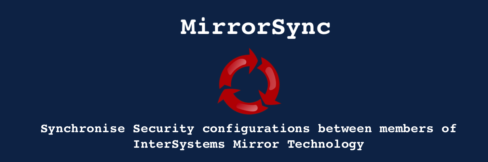
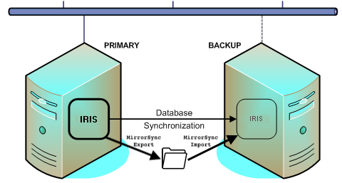

*MirrorSync* includes some rutines to synchronise all security configurations between nodes of a InterSystems Mirror. This tool executes periodically an export of all security configurations (Users, Roles, Resources, Web Applications, ... ) and updates the same configuration in the backup members.

# What is included?
*MirrorSync* includes the rutines that export the changes in Security configurations to execute in the Primary member and also the import to be don in the Backup members.

# How does it work?
SecurityMirrorSync solves this by exchanging security export files from the primary (active) failover member to the backup (inactive) failover member.
In summary, this add-on consists of a Task that checks the Audit database. In case the Task founds an entry of  creation/change of a user, role, resource, etc it exports only the type of information changed.
For example: In the case a user has been created, The routine launched by the Task, exports all the users.


SecurityMirrorSync does not remove Users, Roles, Resources, etc.
It is recommended to disable users instead of removing them from the system (while using this add-on).
For SecurityMirrorSync to work properly, do not disable the following Audit events:

%System/%Security/ResourceChange

%System/%Security/RoleChange

%System/%Security/UserChange

%System/%Security/ApplicationChange

%System/%Security/SSLConfigChange

Also, do not remove the Scheduled Task SecurityMirrorSync.

# Quick Start
1. Clone the repository:
```
git clone https://github.com/intersystems-ib/MirrorSync
```
2. Build and run the sample environment. This will run two instances if [InterSystems IRIS For Health](https://www.intersystems.com/products/intersystems-iris-for-health/) with MirrorSync installed
```bash
docker-compose build
docker-compose up -d
```

You can access now to the [Management Portal of the Primary Server](http://localhost:52773/csp/sys/UtilHome.csp) using `superuser`/ `SYS`.

Make some changes in Security Options and check how they are translated to the [Backup Server](http://localhost:52774/csp/sys/UtilHome.csp) using `superuser`/ `SYS`.

# Requirements
MirrorSync supports:
* **InterSystems IRIS** version >= 2020.1.
* **InterSystems IRIS For Health** version >= 2020.1.
* **Health Connect** version >= 2020.1.

# Installation
These install actions need to be performed on each Mirror member machine:
* Choose a <<**Shared Folder**>> that is accesible by both Mirror members (this <SharedDir> could be different mounted name on each member, but in fact must be the same physical storage place for both members)
---
* Note: This directory must have the same permissions as the IRIS-install-directory has.
---
* If you already have [ZPM Package Manager](https://github.com/intersystems-community/zpm), you can just move to your namespace and type:

```
TEST> zpm
zpm:TEST> install mirror-sync
```
If not, please install it first, following the instructions in https://github.com/intersystems-community/zpm

---
**NOTE**

*This application is an open-source add-on for InterSystems HealthCare products and does not form part of the official release. InterSystems WRC technical assistance will not attend issues related with this application.*

---

